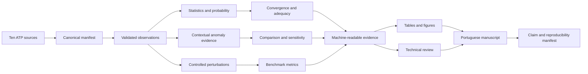

# Thesis Defense Evidence Package Design

**Spec:** `specs/features/thesis-defense-evidence/spec.md`
**Context:** `specs/features/thesis-defense-evidence/context.md`
**Status:** Approved for execution

## Architecture overview

The implementation adds a library-first defense layer around existing parser,
validation, and artifact-writing seams. Primary statistics operate on validated
observations, never on detector-filtered rows. Analytical methods emit explicit
scores, flags, applicability, and diagnostics. A final orchestrator consumes
saved machine-readable evidence to generate publication artifacts and an
immutable claim index.

## Code reuse analysis

| Existing component | Location | Reuse |
|---|---|---|
| ATP parser | `src/parser/__init__.py` | Load declared runs and maxima |
| Observation validation | `src/services/validation.py` | Enforce keys, selections, and integrity |
| Preprocessing | `src/services/preprocessing.py` | Preserve normalized observation flow |
| Gaussian primitives | `src/services/statistics.py` | Reuse fitting and tail survival function |
| Clustering primitives | `src/services/clustering.py` | Preserve descriptive labels only |
| Pipeline | `src/services/pipeline.py` | Integrate stable evidence contracts |
| Artifact writer | `src/services/reporting.py` | Extend hashing and safe output policy |
| Plot primitives | `src/services/visualization.py` | Reuse axes conventions after semantic fixes |

Existing fragile behavior is isolated before extension: detector candidates
must not be removed from primary statistics, highest-centroid membership must
not become evidence, and signed source maxima must survive preprocessing.

## Components

### Canonical dataset manifest

- **Location:** `src/services/dataset_manifest.py`
- **Purpose:** Discover the ten scenario-size sources, validate 112677 V,
  counts, hashes, experiment identity, and exclusions.
- **Interfaces:** `build_dataset_manifest()`, `validate_dataset_manifest()`.
- **Output:** One typed row per source plus explicit coverage and relationship
  status.

### Statistical evidence

- **Location:** `src/services/statistical_evidence.py`
- **Purpose:** Descriptives, strict empirical exceedance, Wilson interval,
  Gaussian comparison, adequacy status, and robust MAD evidence by group.
- **Interfaces:** `summarize_statistical_evidence()` and
  `evaluate_distribution_adequacy()`.
- **Applicability:** Fewer than eight values is undersized for adequacy;
  zero variance is degenerate; both remain valid for empirical boundaries.

### ATP probability reconciliation

- **Location:** `src/parser/statistical_distribution.py` and
  `src/services/probability_reconciliation.py`
- **Purpose:** Parse ATP distribution tables and reconcile printed bins with
  direct counts using declared boundary and printed-precision tolerance.

### Contextual anomaly evidence

- **Location:** `src/services/kmeans_evidence.py`,
  `src/services/dbscan_evidence.py`, and `src/services/comparison.py`
- **Purpose:** Fit within explicit comparable groups and emit labels separately
  from Boolean evidence.
- **K-Means:** Standardized `value_pu`, deterministic seeds, distance to
  assigned centroid, development 99th-percentile threshold.
- **DBSCAN:** Standardized feature, development nearest-neighbor 95th-percentile
  epsilon calibration, explicit cluster/noise diagnostics.
- **Comparison:** Count only applicable explicit flags and serialize only met
  criteria.

### Controlled benchmark

- **Location:** `src/services/perturbations.py` and
  `src/services/benchmark.py`
- **Purpose:** Deterministic copied-data interventions, lineage-safe splits,
  confusion counts, and safe derived metrics.
- **Families:** Point magnitude, contextual group-relative, and collective
  contiguous-run shifts, plus clean controls.

### Convergence and sensitivity

- **Location:** `src/services/convergence.py` and
  `src/services/sensitivity.py`
- **Purpose:** Compare compatible sizes and parameter policies; compute absolute
  and relative deltas plus identity Jaccard overlap.
- **Rule:** A 10,000-run case is a high-sample reference, never ground truth.

### Technical review

- **Location:** `src/services/technical_review.py`
- **Purpose:** Select representative strata and serialize review records with
  source, signed value, context, evidence, reviewer, date, and rationale.
- **Rule:** Missing causal evidence produces `unresolved`.

### Publication and package generation

- **Location:** `src/services/defense_reporting.py` and
  `src/services/defense_visualization.py`
- **Purpose:** Generate CSV/JSON sources, deterministic LaTeX tables, Portuguese
  figures, claim mappings, output hashes, and semantic reproduction records.
- **CLI:** `scripts/build_defense_evidence.py` builds a new versioned directory
  and refuses failed prerequisite gates.

## Data contracts

Every observation retains `scenario`, `sample_size`, `source_lineage`,
`source_file`, `source_sha256`, `simulation`, `terminal`, `phase`,
`source_value`, `value_pu`, `time`, `base_voltage`, and `event_definition`.

Every analytical method emits `method`, `score`, `threshold`, `flag`,
`applicability`, `reason`, `group_key`, `feature_space`, `scaling_policy`, and
`configuration_id`. Undefined metrics remain null with a reason.

Every artifact includes `schema_version`, `generator_version`, source hashes,
configuration hash, code revision, command, validation status, and semantic
hash policy.

## Error handling

| Scenario | Handling |
|---|---|
| Missing scenario-size source | Emit missing coverage; package incomplete |
| Base other than 112677 V | Exclude with exact reason |
| Missing provenance | Reject comparable status |
| Undersized/constant group | Method non-applicable with reason |
| DBSCAN all noise | Degenerate; no evidence vote |
| Zero metric denominator | Null metric with reason |
| Missing electrical review | Preserve analytical candidate as unresolved |
| Artifact schema mismatch | Reject with expected/actual version |
| LaTeX/source disagreement | Fail package acceptance |

## Technical decisions

| Decision | Choice | Rationale |
|---|---|---|
| Binomial interval | Wilson, 95% | Stable at zero/one without forced extrapolation |
| Adequacy | Anderson-Darling, 5% + graphical/effect evidence | Tail-sensitive and not interpreted from p-value alone |
| Robust baseline | Modified MAD score, 3.5 | Explicit robust comparison; degenerate MAD is N/A |
| Grouping | Scenario, lineage, terminal, phase | Prevent normal structural offsets becoming anomalies |
| K-Means evidence | Distance, development p99 | Labels remain descriptive |
| DBSCAN policy | Standardized k-distance p95 | Scale and parameter source become auditable |
| Stability | Jaccard, 0.80 qualification threshold | Measures candidate identity, not only rate |
| Artifacts | `results/defense-evidence/v1`, schema 1.0.0 | Versioned, non-destructive final package |
| Figures | SVG + PNG 300 DPI, Okabe-Ito | Publication and grayscale accessibility |
| Tables | CSV source + generated `\\input` LaTeX | Numerical traceability without manual copying |

## Requirement mapping

| Component | Requirements |
|---|---|
| Dataset manifest and identity | DEF-01, DEF-02, DEF-03 |
| Statistical evidence and reconciliation | DEF-04, DEF-05, DEF-06, DEF-07, DEF-25 |
| Contextual anomaly evidence | DEF-08, DEF-09, DEF-10, DEF-11 |
| Controlled benchmark | DEF-12, DEF-13 |
| Convergence, comparison, sensitivity | DEF-14, DEF-15, DEF-16 |
| Technical review | DEF-17, DEF-26 |
| Publication outputs | DEF-18, DEF-19, DEF-27 |
| Manuscript and immutable package | DEF-20, DEF-21, DEF-22, DEF-23, DEF-24 |
